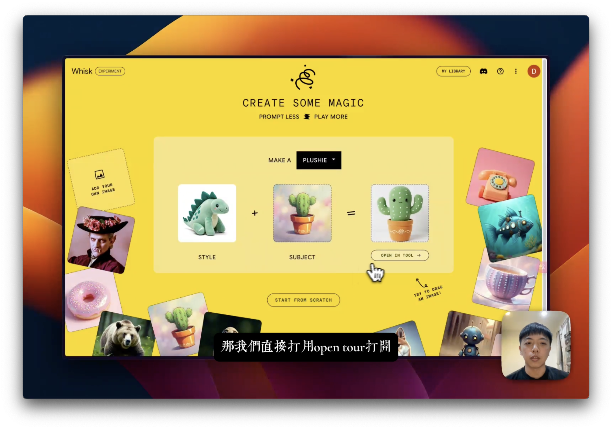
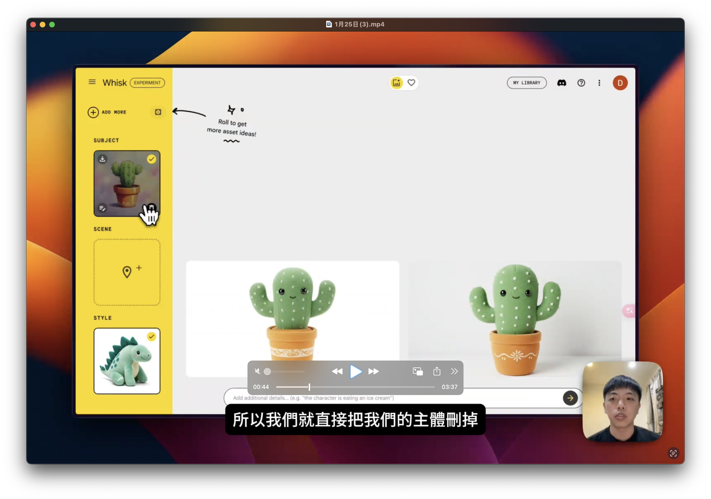
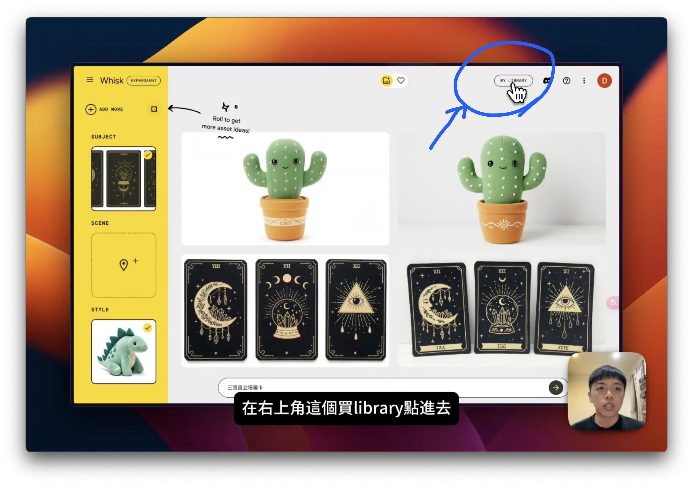
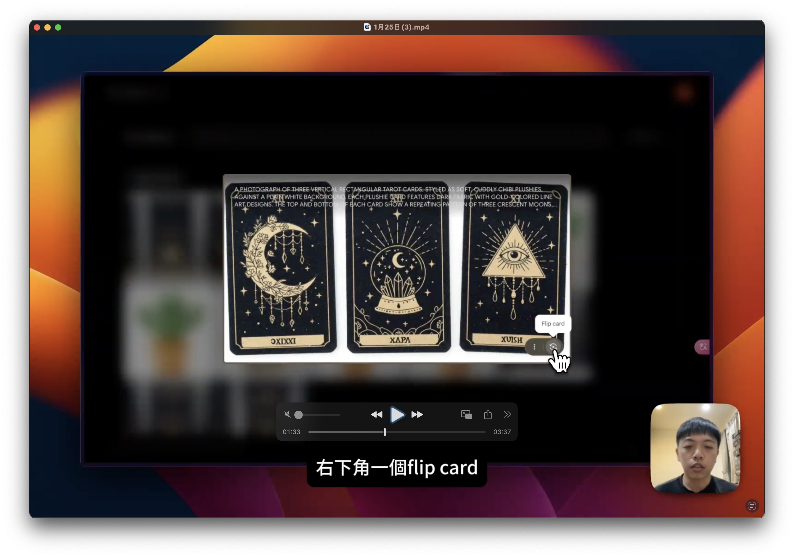
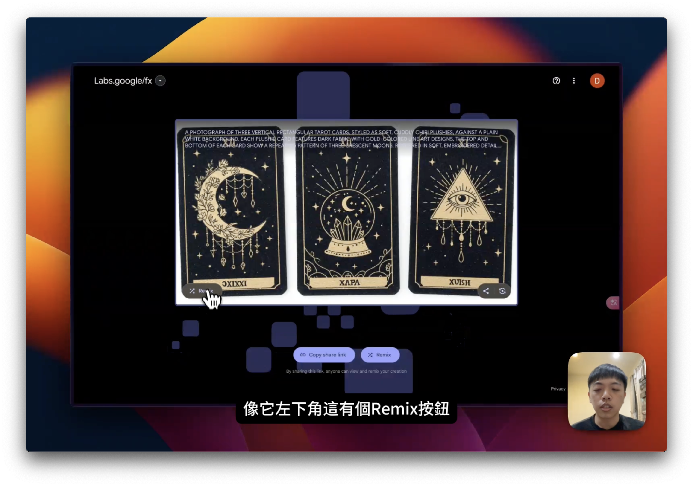
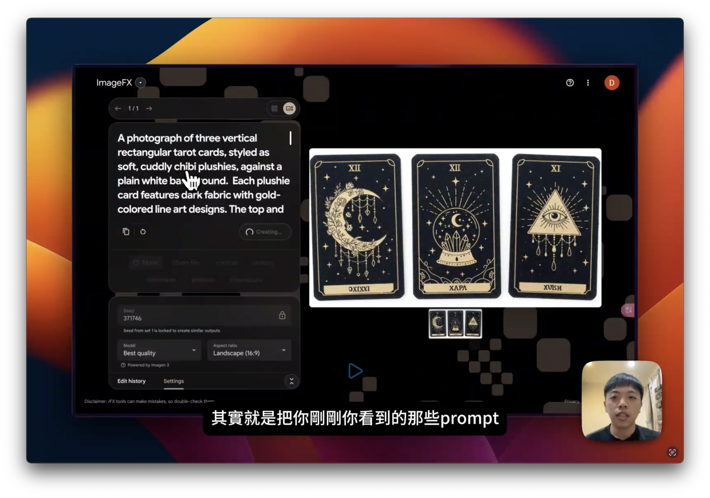
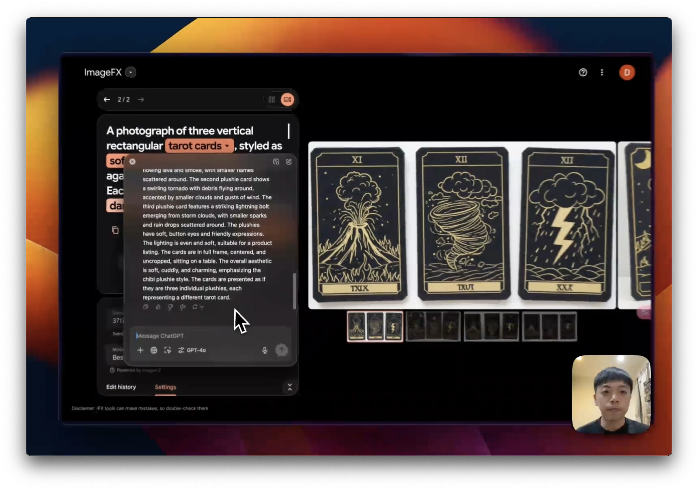

這裡是文字記錄，建議可以先看過影片檔（三分鐘而已，建議 1.5 倍速）：


> ⭐ 想試玩已經做好的星空卡可以到這裡：[網站連結](https://www.dweam.xyz/draw)

## 什麼是 Whisk？

**Whisk** 是 Google 推出的一個圖片生成工具，它的特點在於可以根據用戶提供的描述（prompt），生成擁有特定材質或風格的圖片，並且**完全免費使用**。這項服務操作簡單，即使是非專業人士也能輕鬆上手。

### ⚠️⚠️⚠️ 
### Whisk 目前只對美國用戶開放，如果要使用必須透過 VPN 服務 ！
### ⚠️⚠️⚠️

## 第一步：在官網上試玩

1. **進入 Whisk 官網**：打開 Whisk [網站](https://whisk.google.com/)，你可以直接從首頁進行圖片生成。
2. **上傳圖片**：將你的素材（例如仙人掌圖片）拖入 Whisk 的操作界面。
3. **選擇材質**：Whisk 將根據你的描述，自動將圖片轉換為指定的質感，例如將仙人掌變成絨毛玩偶的質地。

在這一步中，你可以立即看到結果。例如，將一張普通圖片(subject)加上風格(style)後，可以輕鬆調整細節，變成玩偶風格的仙人掌。

## 第二步：調整生成圖片

1. **進入生成畫面**：用 Open in tool 或者右上角的 Experiment 按鈕開啟生成畫面。
2. **刪除不必要的元素**：若要創建自己的 style 或 subject，可將多餘的圖片內容刪除。
3. **輸入描述（prompt）**：在輸入欄中輸入你的需求，無論是中文還是英文，Whisk 都能正確解析。例如，可以輸入「生成刺繡風格的塔羅牌」。
4. **進一步微調**：你可以選擇重新生成或編輯 prompt 內容，以確保得到滿意的效果。

## 進階操作：結合 Library 與 Remix 功能

1. **進入 Library**：點擊右上角的 Library 按鈕，查看 Whisk 為你生成的所有圖片。

   
2. **進入圖片信息**：點擊圖片後，右下角 flip card 後卡片詳細資訊會顯示 prompt 和 seed（隨機生成參數），方便進一步調整。

1. **使用 Remix 功能**：進入後，選擇分享將連結複製後，貼到新的視窗，他會打開下面的畫面，再點擊 Remix。

1. **Google Image Fx**：在 Remix 點擊後，會進入 Google Image Fx。在這裡你可以修改 prompt，調整材質的軟硬度（如 soft、hard、rough）來嘗試不同風格。

> 你也可以透過我的 google image FX [分享連結](https://labs.google/fx/tools/image-fx/1v91njbrc0000)當作起點開始嘗試哦。

## 提升效果：利用 ChatGPT 編輯 Prompt

若需要更精確的生成效果，可以將 Whisk 的 prompt 貼入 ChatGPT，並要求 AI 進行優化。例如：

- **需求描述**：將塔羅牌改為火山爆發、龍捲風和閃電的圖案。
- **修改提示**：要求 ChatGPT 保留原有材質，僅調整主題內容。

將 ChatGPT 優化的 prompt 貼回 Whisk，點擊生成，即可得到一組全新的圖片。

## 反覆調整與創作的可能性

Whisk 每次會生成多張圖片，供用戶挑選。如果生成結果仍未達到理想效果，將修改後的 prompt 再次貼入 ChatGPT，提出更具體的要求（例如更多顏色或特殊光效），即可不斷改進圖片質感。

## 總結

使用 Google Whisk，從創建初稿到微調細節，整個過程都簡單高效，讓任何人都能輕鬆上手並創造專業水準的作品。不論是設計刺繡風格卡片還是生成塔羅牌，Whisk 都是不可或缺的創意工具。

希望這篇指南能幫助你更好地利用 Whisk，開始創造屬於你的驚艷作品！

> 如果這篇文章對你有幫助，請分享給你的朋友吧！對 AI 創作或軟體開發有興趣的話，可以追蹤我的 [Threads](https://www.threads.net/@doraraisme) 每週會固定發表新的創作心得！